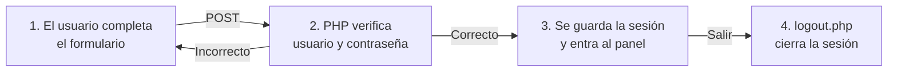
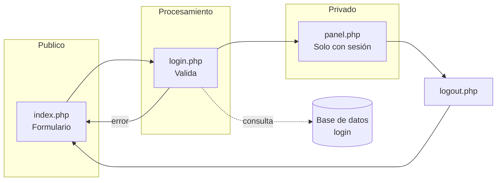

# Login PHP Simple

Sistema de login en PHP con Bootstrap. Usa la base de datos `login` de XAMPP.
Está pensado para ser claro y didáctico: cada parte hace una sola cosa y el código está comentado en los puntos clave.

---

## 1. ¿Qué es un sistema de login?

Un sistema de login permite **identificar** a un usuario (¿quién es?) y **autorizar** el acceso a contenido privado (¿puede entrar?).

El proceso completo tiene 4 momentos:



La pieza clave es la **sesión**: un espacio de memoria del servidor que "recuerda" quién está logueado mientras navega entre páginas.

---

## 2. Estructura del proyecto

| Archivo        | Función                                                        |
|----------------|----------------------------------------------------------------|
| `conexion.php` | Conecta PHP con la base de datos `login` (una sola vez, para todo el proyecto) |
| `index.php`    | Muestra el formulario de usuario y contraseña                  |
| `login.php`    | Recibe el formulario, valida contra la base y crea la sesión    |
| `panel.php`    | Página privada: solo visible con sesión iniciada               |
| `logout.php`   | Destruye la sesión y vuelve al login                           |
| `usuarios.sql` | Crea la tabla `usuarios` dentro de la base `login`             |

Flujo entre archivos:



---

## 3. Cómo funciona, archivo por archivo

### 3.1 `conexion.php` — La conexión

Centraliza los datos del servidor (`localhost`, base `login`, usuario `root`, sin contraseña) y crea el objeto PDO con el que todas las páginas hablan con la base.

- `new PDO(...)` crea la conexión con MySQL/MariaDB.
- `ERRMODE_EXCEPTION`: si una consulta falla, PHP lanza un error (excepción) en vez de callarse.
- `FETCH_ASSOC`: cada fila se lee como `['id' => 1, 'usuario' => 'admin']`.
- El bloque `try/catch` captura errores de conexión y muestra el mensaje.

> El resto del proyecto usa la variable `$conexionbd`. Solo este archivo debe saber los datos de acceso a la base.

### 3.2 `index.php` — El formulario

- `session_start()` abre la sesión (si ya hay una iniciada, redirige directo a `panel.php` con `header("Location: ...")` y `exit`).
- El HTML muestra un formulario con dos campos (`usuario` y `clave`).
- `method="POST"`: los datos viajan **ocultos** en la petición (no aparecen en la URL).
- `name="usuario"` y `name="clave"`: estos nombres son los que `login.php` usa para leer los datos con `$_POST`.
- `required`: el navegador no deja enviar campos vacíos.
- Si en la URL llega `?error=1`, se muestra el aviso "Usuario o contraseña incorrectos".

### 3.3 `login.php` — La validación

Es el corazón del sistema. Hace 4 cosas:

1. **Recibe los datos**: `$usuario = $_POST["usuario"];` y `$clave = $_POST["clave"];`
2. **Consulta la base**: busca el usuario con una **consulta preparada** (el `?` es un marcador que se reemplaza después, esto evita la inyección SQL):

   ```php
   $consulta = $conexionbd->prepare("SELECT * FROM usuarios WHERE usuario = ?");
   $consulta->execute([$usuario]);
   $fila = $consulta->fetch();   // la fila encontrada, o false si no existe
   ```

3. **Valida**: existe el usuario (`$fila` no es `false`) **y** la contraseña coincide (`password_verify`):

   ```php
   if ($fila && password_verify($clave, $fila["clave"])) {
       $_SESSION["usuario"] = $fila["usuario"];
       header("Location: panel.php");
       exit;
   }
   ```

4. **Responde**: si todo está bien → guarda la sesión y entra al panel. Si no → vuelve a `index.php?error=1`.

> `password_verify` compara la contraseña escrita con el **hash** guardado en la base. En la tabla nunca se guarda la contraseña "en claro".

### 3.4 `panel.php` — La página privada

- Empieza con una **guardia de seguridad**:

  ```php
  if (!isset($_SESSION["usuario"])) {
      header("Location: index.php");
      exit;
  }
  ```

  Si alguien intenta entrar a `panel.php` sin estar logueado, es redirigido al login. Esta misma línea es la que se copia al inicio de **cualquier** página que querramos proteger.

- Muestra el nombre del usuario con `<?php echo $_SESSION["usuario"]; ?>`.

### 3.5 `logout.php` — Cerrar sesión

```php
session_start();
session_destroy();
header("Location: index.php");
```

`session_destroy()` borra todos los datos de la sesión (el servidor "olvida" quién estaba logueado) y se vuelve al login.

---

## 4. Conceptos importantes

| Concepto | Qué es | Dónde se usa |
|----------|--------|--------------|
| `$_SESSION` | Datos que se mantienen entre páginas mientras dura la sesión | Guardar el usuario logueado |
| `session_start()` | Inicia/reanuda la sesión | Primera línea de los archivos PHP que la usan |
| `session_destroy()` | Borra la sesión | `logout.php` |
| `$_POST` | Datos enviados por un formulario con `method="POST"` | `login.php` |
| `$_GET` | Datos que viajan en la URL (`?clave=valor`) | El aviso de error (`?error=1`) |
| `password_verify()` | Compara una contraseña con su hash | `login.php` |
| `password_hash()` | Genera el hash de una contraseña (se usa al crear usuarios) | `usuarios.sql` (ya viene hasheada) |
| Consulta preparada | Consulta con `?` que recibe los valores después | `login.php` (evita inyección SQL) |
| `header("Location: ...")` | Redirige el navegador a otra página | En todos los flujos |
| `exit` | Detiene la ejecución del script | Después de cada redirección |
| `require` | Incluye el contenido de otro archivo | `login.php` → `conexion.php` |

---

## 5. La base de datos

La tabla `usuarios` se crea con `usuarios.sql`:

```sql
CREATE TABLE IF NOT EXISTS usuarios (
    id INT AUTO_INCREMENT PRIMARY KEY,  -- número único de cada usuario
    usuario VARCHAR(50) NOT NULL UNIQUE,-- nombre de usuario (no se repite)
    clave VARCHAR(255) NOT NULL         -- contraseña guardada como hash
);
```

La contraseña se guarda **hasheada** (con `password_hash`), nunca en texto plano. El hash de `1234` es algo así:

```
$2y$10$k9IsZwqtJpIxGV9LvsiJEeZRQ2ZwywhiaNO26UpEsKggOUxMdPFey
```

---

## 6. Puesta en marcha (XAMPP)

1. Iniciá **Apache** y **MySQL** en el panel de XAMPP.
2. Importá `usuarios.sql` en phpMyAdmin (crea la tabla `usuarios` dentro de la base `login`).
3. Copiá el proyecto dentro de `htdocs` (o abrí la carpeta directamente en el servidor).
4. Accedé a `http://localhost/login-php/`.
5. Entrá con:

   - **Usuario:** `admin`
   - **Contraseña:** `1234`

---

## 7. Seguridad mínima

Este proyecto aplica tres medidas básicas, fáciles de entender:

1. **Contraseñas con hash** — no se guardan en texto plano, se comparan con `password_verify`.
2. **Consultas preparadas** — el `?` en la consulta impide la inyección SQL.
3. **Guardia de sesión** — cada página privada verifica que exista `$_SESSION["usuario"]` antes de mostrar contenido.

Si querés agregar más seguridad (por ejemplo, limitar intentos o usar HTTPS), podés hacerlo más adelante; el esquema base no cambia.

---

## 8. Datos de prueba

| Usuario | Contraseña |
|---------|------------|
| `admin` | `1234` |

Para agregar más usuarios, insertá un nuevo registro en la tabla `usuarios` con su hash (en `phpMyAdmin`, o con `password_hash()` desde PHP).
